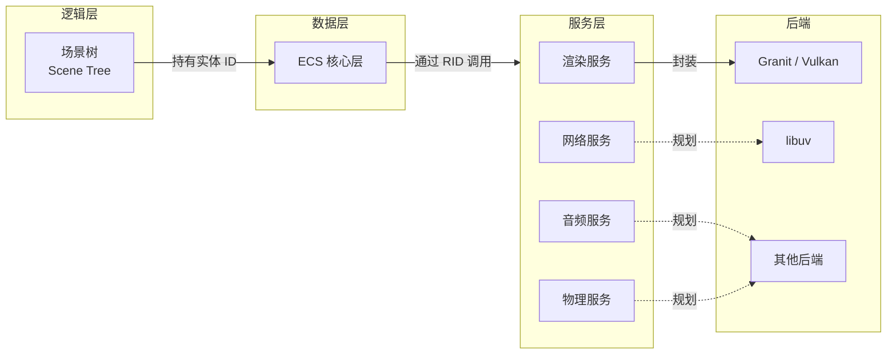

<!-- SPDX-License-Identifier: MIT -->
<!-- Copyright (c) 2026 Gneiss contributors -->

# Gneiss 总体架构

## 当前状态

本文定义 Gneiss 的目标分层和模块边界。项目仍处于早期开发阶段；图中的音频、物理及其他后端属于架构边界，不代表相关功能已经完成。

## 分层关系

### 逻辑层

场景树负责组织游戏对象及其层级关系，为开发者提供直观的场景编辑与运行时管理模型。

### 数据层

ECS 核心层负责实体、组件和系统的数据组织与调度。场景节点持有实体 ID，将易用的层级结构映射到高效的数据布局。

### 服务层

渲染、网络、音频和物理能力按独立服务划分。ECS 通过资源 ID（RID）引用服务管理的资源，避免业务组件直接依赖具体后端对象。

### 后端层

后端层承接平台与第三方库实现。当前渲染后端基于 Granit/Vulkan；网络、音频、物理等后端尚未
实现，将在真实用例和方案确认后记录到对应 ADR 和 Reference。

## 核心技术

| 领域 | 技术或方案 | 当前定位 |
| --- | --- | --- |
| 编程语言 | C++20 | 项目语言标准 |
| 图形 API | Vulkan | 由 Granit 封装 |
| 渲染基础 | Granit | 渲染服务后端 |
| 数据架构 | ECS | 核心运行时数据层 |
| 场景组织 | Scene Tree | 逻辑对象与层级管理 |
| 资源管理 | Service + RID | 服务边界与资源引用 |
| 异步网络 | 尚未选型 | 后续阶段按真实用例决策 |
| 目标平台 | Windows、Linux | 初始平台范围 |

## 边界约束

- 场景树不直接持有后端资源对象，只关联实体 ID。
- ECS 组件保存数据或 RID，不持有后端库的原生句柄。
- 服务负责资源生命周期、有效性校验和后端调用。
- 第三方库类型不应跨越公共服务边界，除非对应 Reference 明确定义。
- 新增跨层依赖前，应通过 ADR 记录背景、选择和影响。
