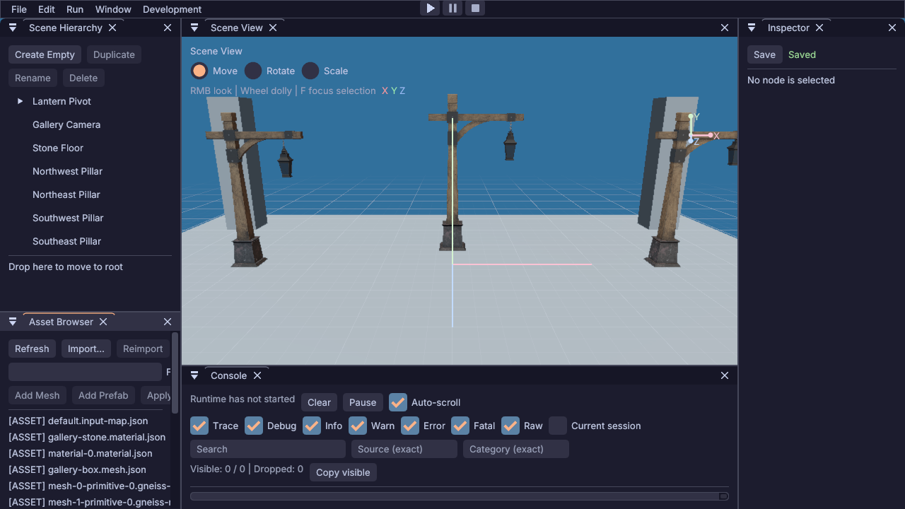

<!-- SPDX-License-Identifier: MIT -->
<!-- Copyright (c) 2026 Gneiss contributors -->

# 编辑器网格密度与渐隐优化

2026-09-23，针对固定 0.25 米网格远处过密的问题，在 Editor 内新增自适应网格生成器。
保留现有 Debug Draw 和深度测试，不修改公共 ABI 或 Granit。

## 当前实现

- 按相机高度选择世界对齐的四倍间距层级，细线逐渐淡出，主次线亮度随层级过渡。
- 依据估计屏幕间距、观察角度和距离降低透明度；网格边缘淡出，避免硬截断。
- 使用分段透明度近似沿线渐隐，降低次网格对比度，保留 XYZ 轴。
- UI 标注改为自适应间距，不再声称所有视距下次网格都是 0.25 米。

这是现有线段接口上的第一轮优化，不是解析抗锯齿。单条线边缘仍由 Debug Draw 光栅化，
没有增加 MSAA、FXAA 或专用 Grid Shader；分段渐隐可能仍有阶梯感。生成成本也高于原有固定线段，
本轮未做性能基准。后续专用 Shader 应在像素内处理覆盖率和密度，避免继续增加 CPU 细分。

## 验证

- Clang Debug 编辑器构建通过，网格、Camera、Gizmo 数学、Editor smoke 和 Lantern Editor 共 5 项
  相关测试通过。覆盖无效视口、非有限输入、贴地观察、跨层级高度及低分辨率细线覆盖减少。
- 新网格实现通过 clang-tidy 用户代码检查；修改的源码使用 clang-format 格式化。
- 同一 Lantern 场景、相机及 1280×720 输出 GPU 读回显示远端密线退隐，近处刻度保留。
  临时读回代码已移除并重新构建。未验证真实鼠标移动时的闪烁、其他 DPI 或其他后端。
- 此轮不重复依赖升级全矩阵；未推送或执行远端操作。

优化前见[上一轮画面](images/2026-09-23-lantern-editor-fixed.png)，本轮结果如下：

## 渐隐范围回调

用户反馈中距离消失过早后，将范围扩大为首版的 1.5 倍，距离渐隐起点从半径的 35% 推迟到 50%，
放宽掠视角渐隐区间。主网格按四倍细线间距估计屏幕密度，避免和细线一起提前消失。
亮度上限保持不变，优先保留远处稀疏主线，而非恢复远处全部细线。

新增中远距离主线可见而细线退隐的断言，5 项相关测试通过；移除临时读回后又通过网格与两个 Editor
smoke。同一默认相机读回复核如下（未重建用户截图中的精确相机姿态）：

## 缩放层级跳变修复

用户报告滚轮拉远时跳动。回归测试确认：相机高度跨 10、40、160 米层级边界时，同一世界线从主线
转为细线，密度估计系数会从 4 突变为 1；亮度层级虽有过渡，密度渐隐却没有同步过渡。
新测试采样边界两侧同一世界位置的线段 Alpha，要求差值不超过一个量化单位，旧实现返回失败码 9。

现将密度系数随层级混合连续变化，并使沿线渐隐采样跟随相机连续移动，仅固定世界刻度保持网格对齐。
相机滚轮移动行为没有修改。修复后同一回归和其余 4 项相关测试通过，网格实现 clang-tidy 无用户代码
告警。尚未实际执行鼠标滚轮动态视觉验收，因此不将所有运动闪烁或输入顿挫描述为已修复。
