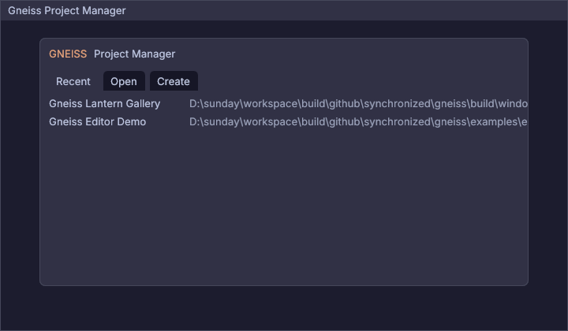
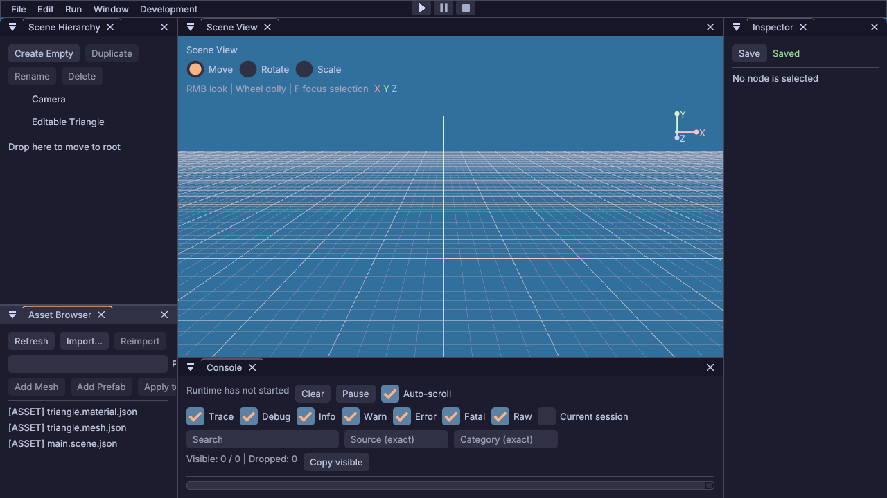

<!-- SPDX-License-Identifier: MIT -->
<!-- Copyright (c) 2026 Gneiss contributors -->

# Granit 0.28.0 升级验收

## 范围

2026-09-23 将 Gneiss 当前开发分支的 Granit 基线由 0.23.0 升级至
[v0.28.0](https://github.com/synchronized/granit/releases/tag/v0.28.0)，锁定提交
`1cb4e7456c339b2f4edfdded050ada1587e1b5f5`。FETCH、PACKAGE 和安装配置采用 0.28 最低版本；
保持 MIT 依赖许可、既有后端替代边界及 Gneiss 公共 C11/C++20 ABI，不引入新依赖。

## 适配结果

- 移除独立 Input 组件、链接目标和实例。Window System 在每轮主循环先显式泵送，再消费窗口、
  输入队列和状态；事件使用强类型枚举，在 Gneiss 边界转换为现有公共数值。
- 原生窗口改用 Win32/XCB/Wayland 版本化快照，Renderer 显式开启呈现。继续由主线程拥有窗口，
  Render Service 渲染线程拥有 GPU 资源，不引入 Granit 托管 Loop 或 Web 平台支持。
- 材质、网格、Scene、Canvas、Debug Draw、纹理及 Render Pipeline 使用新的 C++ 描述和借用引用。
  Swapchain Backbuffer 通过 acquired_frame 获取，引用只在该帧提交/呈现期间使用。
- AssetTools 迁移到 `granit/asset_tools` 头和强类型格式、用途、子资源描述。作者格式、Gneiss
  运行纹理封装、BC7 编码和缓存职责不变。
- 移除为旧 SDK 安装强制构建 CLI 的绕过目标；新 SDK-only 安装无需 CLI。
- Granit Platform 冒烟先运行无相机、无物体的 UI 帧，再运行常规场景和资源替换；Windows 额外
  投递真实窗口按键消息，验证事件泵送和输入转换。

## 本地验证

环境：Windows、Clang 23.1.1、Debug，开发 preset 保持警告视为错误。

| 验证 | 结果 |
| --- | --- |
| Shared 完整构建 | 通过 |
| Shared 全量 CTest | 140 项中 138 项首次通过；两项失败经单独复测通过 |
| Static 完整构建与 CTest | 138/138 通过 |
| Shared/Static 安装后的独立 C11、C++20、属性检查 Consumer | 各 3/3 通过 |
| PACKAGE 模式、关闭平台适配的 AssetTools 工具构建 | 通过，glTF inspect 成功 |
| 旧默认依赖缓存迁移、公共头编译、纹理确定性和非法输入测试 | 包含在全量测试中，通过 |
| Project Manager、纯 UI/输入、Lantern Runtime 工作流 | 对应可用配置的冒烟通过 |
| clang-format、git diff --check | 通过 |

Shared 首次全量测试与 Static 全量编译同时执行时，`runtime.installed-smoke` 达到超时，
`editor.runtime-process` 失败。停止并发编译后，以原测试和原超时单独复测，两项均通过；
同时复测更新后的 Granit Platform，共 3/3 通过。未修改测试时限或跳过失败项。

对窗口与渲染适配运行 clang-tidy，修正新布尔字段的隐式转换；检查未达到零诊断。
保留既有括号/初始化样式、宏的 signed-bitwise 以及渲染线程函数的 exception-escape 等提示，
未禁用检查或扩展为无关重构。严格编译无警告。

安装测试使用重新创建的前缀，Shared 安装目录无 `granit_input.dll`、无 `granit_asset_tool.exe`，
安装 Consumer 与工具仍正常工作。PACKAGE 工具验证复用已下载的其他第三方源码，Granit 来自
已安装的 0.28 SDK。

## 上游旧问题复核

0.23 AssetTools 评审中的 Material/Texture/Environment 结果句柄跨类型销毁问题已复测修复：
无效输入 inspect 返回诊断句柄，三个句柄互不相同；Material 销毁 Texture 句柄返回
`invalid_handle`，三个原句柄分别仍可销毁，重复销毁返回 `invalid_handle`。
SDK-only 安装不再要求 CLI。本次没有修改 Granit 仓库或提交上游 PR。

## 验证边界

纯 UI 与 Project Manager 冒烟证明相关路径可运行，不代表像素级画面已经验收；编辑器黑屏
仍不能仅依据这些结果标记为视觉修复完成。未运行 Linux、MSVC、Sanitizer 或远端矩阵。
此次为本地依赖升级，不包含 Gneiss 0.35.0 发布。

## 后续检查：GPU 像素与窗口呈现

同日继续检查原先未确认的黑屏现象。直接桌面截图仍为整块纯色，连窗口边框也未出现，不能据此
判定 GPU 绘制失败。临时在 Render Service 加入诊断，在第三个渲染帧使用相同 Scene、Canvas、
Debug Draw、Environment 和 Pipeline，将输出换成同尺寸、同 BGRA8 SRGB 格式的可读回纹理。
先取消已 acquire 的窗口帧再执行独立离屏提交，读回后重新 acquire 并正常绘制、呈现窗口帧。
最初在已 acquire 帧期间直接离屏提交返回 invalid_argument，该结果不作为编辑器缺陷结论。

- Project Manager：720×420，3 条 UI 命令、1040 个顶点，读回 1,209,600 字节；标题、Recent/Open/
  Create 标签、项目列表和面板可见。
- Editor Demo：1280×720，8 条 UI 命令、3992 个顶点，读回 3,686,400 字节；菜单、场景树、网格、
  Inspector、资产浏览器与 Console 可见。
- 两次执行中的三个正常窗口帧 present 均返回 success；GPU 读回、批次及渲染也均返回 success。
- Editor Demo 缺少 sources 目录，源资产监听报告 not found；该诊断未阻断 UI 或呈现，本次未修改
  监听行为。

以下图片由 GPU 读回字节按 BGRA 转 RGBA 后直接编码 PNG，没有重绘或生成内容。
它们验证 UI 确实产生像素，不能证明桌面合成器已把交换链画面显示给用户。

临时诊断未纳入产品代码，已恢复原源码、重新构建正式编辑器；Editor、Project Manager、Granit
Platform 三项冒烟再次全部通过。图形路径的像素内容已验证，真实桌面呈现和交互视觉检查仍待确认。

## 后续检查：MSVC Release 与长路径修复

继续在 Windows SDK 10.0.22621.0、MSVC 19.41.34123.0 下启用平台、Runtime、Editor 和完整测试，
验证 `windows-vs2022-release`、`windows-vs2022-static-release`。复用已下载且确认提交身份的依赖
源码，各配置独立编译；没有混用 Clang 生成的库。

Static 首次构建触发 MSB3491：AssetTools 的 `granit_asset_tools_shader_library_source` 和
`granit_asset_tools_shader_object_storage` 两个目标生成的 `.lastbuildstate` 路径超过 260 字符。
本工作区 Library Source 的路径为 262 字符。将 FETCH 的二进制目录从 `_deps/gneiss_granit-build`
缩短为 `_deps/granit` 后，同一路径降至 249 字符，两个目标及完整 Static 构建通过。

Runtime 安装测试现在显式接收 `GNEISS_GRANIT_FETCHED_BUILD_DIR`；两个安装脚本在未传入时使用
新的短目录。避免只改编译目录，却遗漏 SDK 安装。更深的仓库目录仍可能触及 MSBuild 限制，
可按构建指南用 `-B` 指定较短目录。本次未修改 Granit 源码或系统长路径设置。

| 验证 | 结果 |
| --- | --- |
| MSVC Shared Release 完整构建 | 通过 |
| MSVC Shared Release 全量测试 | 139/140 首次通过，Lantern Runtime 工作流单独复测通过 |
| MSVC Static Release 短目录完整构建、全量测试 | 138/138 通过，含两个安装验收 |
| Shared 安装包的 C11、C++20、属性检查 Consumer | 3/3 通过 |
| Static 安装包的 C11、C++20、属性检查 Consumer | 3/3 通过 |
| 更新后的 Shared 安装脚本，显式传入旧依赖构建目录 | 通过 |

Shared 完整构建与全量测试使用更改前的依赖目录；随后用更新后的安装脚本复核显式目录参数。
Static 在新的短目录完整重建并验证。此次仅调整 CMake 构建和安装路径，没有修改 C/C++ 实现或 ABI，
因此未重复 Clang 全量矩阵。两种 MSVC 配置均保持 Gneiss 警告视为错误；libuv 自身产生的类型转换
警告未通过修改第三方代码或关闭检查处理。

Shared Lantern 工作流首次并行执行失败且未输出具体诊断，单独复测通过；首轮原因未定位，
不将其自动归因于编译负载。未放宽测试超时、跳过测试或改变断言。

当前机器返回 WSL_E_WSL_OPTIONAL_COMPONENT_REQUIRED，无法进行本机 Linux 验证。Linux、Sanitizer、
远端矩阵及真实桌面呈现检查仍未完成，本次不构成 0.35.0 发布验收。
