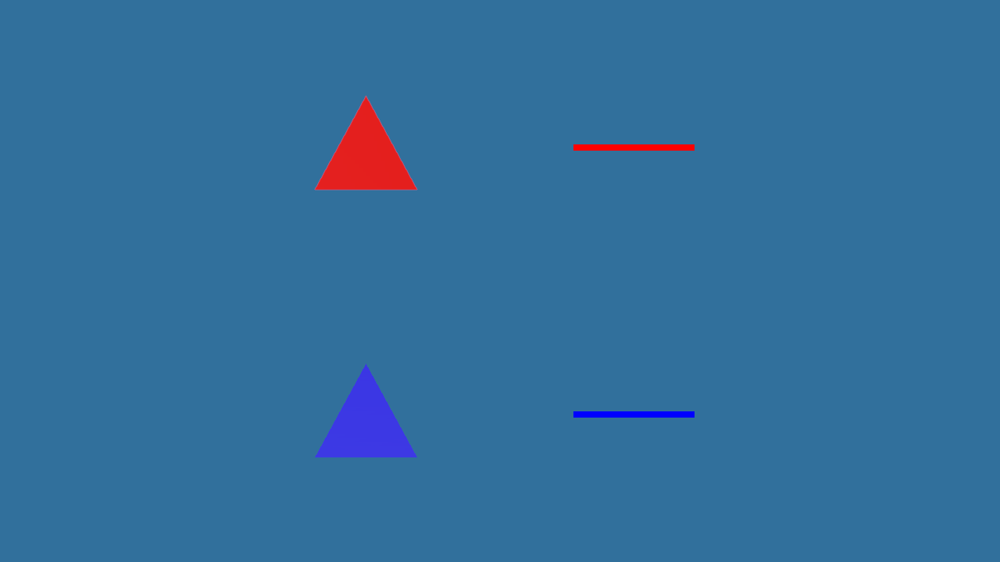

<!-- SPDX-License-Identifier: MIT -->
<!-- Copyright (c) 2026 Gneiss contributors -->

# Granit 0.28.1 坐标契约接入

## 变更

2026-09-23，依赖锁定至 Granit 0.28.1 发布提交
`201adc8a4e4ed205cecb5bd99e3b207eb2d99c84`。上游
[PR #78](https://github.com/synchronized/granit/pull/78) 通过 Vulkan 负高度 Viewport、
正面绕序转换和 Canvas 投影统一坐标契约，没有采用旧诊断中建议的单独修改色调映射 UV 方案。

Gneiss 移除相机投影的 `-focal` 补偿，采用 Y 向上、右手、深度 0..1 的逻辑裁剪空间。
内部函数更名为 `build_perspective_matrix`；相机测试同时检查上、下方点及近、远平面。
ImGuizmo 原有正 Y 投影保持不变。公共 ABI 和场景资产格式没有变化。

FETCH 默认提交、PACKAGE 与安装依赖的最低版本同步升级；渲染实现编译期拒绝 0.28.0，防止旧后端
与新投影混用。保留默认缓存迁移和显式版本覆盖机制。

## 像素验证

复用[旧版复现场景](2026-09-23-version-035-local-matrix.md#场景-y-方向诊断)及相同读回方法。
Windows Clang Shared Debug 下，1280×720 BGRA8 SRGB 输出直接保存为 PNG，没有反转像素行。
红色模型和调试线均位于上方，蓝色模型和调试线均位于下方，三角形尖端恢复向上。

采集用临时代码已移除，正常产物重新构建。此测试确认场景与调试图形的方向，未覆盖背面剔除、
深度遮挡、真实桌面合成和 Gizmo 拖动／拾取的全部交互。

## 构建与测试

- Windows Clang Shared Debug 完整构建通过；完整 CTest 首轮 140/141 通过，安装冒烟超时。
  超时留下 `runtime-package.gneiss-exporting`，首次单独复测被打包防覆盖规则拒绝。将该测试残留
  移至构建目录内保留后，原超时阈值下再次复测通过，用时 62.66 秒。没有放宽测试或修改打包规则。
- 相机上下方向、Render Snapshot、Gizmo 数学、Runtime/Editor 冒烟、Cooked Lantern、版本缓存迁移、
  安装稳定 Consumer 均包含在共享库测试中。
- 修改过的渲染数学及测试通过 clang-format；相机实现 clang-tidy 未报告用户代码告警。
- Windows Clang Static Debug 完整构建通过，完整 CTest 138/138 通过（38.01 秒），含安装 Runtime、
  C/C++ Consumer 和公共头文件验证。

Linux、WebGPU 和 MSVC 本轮未验证；上游测试结果不等同于 Gneiss 本地验收。没有修改 Granit 源码
或执行远端写入操作。M-236 的跨平台和完整桌面交互验收仍未完成。
