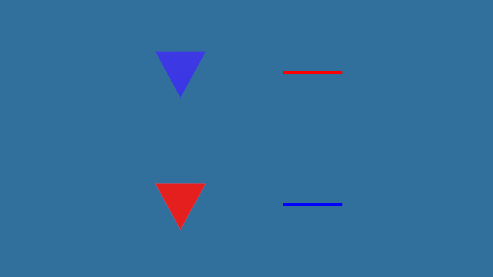

<!-- SPDX-License-Identifier: MIT -->
<!-- Copyright (c) 2026 Gneiss contributors -->

# 0.35.0 本地矩阵与 IPC 测试检查

- 日期：2026-09-23
- 范围：M-236 的 Windows 本地验证；不构成发布验收完成。
- 关联：[实施计划](../plans/VER-035-0.35.0-texture-asset-variants.md)、
  [M-235 验收](2026-09-23-texture-variant-diagnostics.md)。

## IPC 测试检查

上轮 `gneiss.runtime.ipc-session` 失败时没有用例诊断。本轮修改前连续执行 30 次未复现，不能将
历史失败唯一归因于某一原因。

源码检查发现辅助函数一次从 Transport 队列移出最多 64 条事件，却在遇到首条 Envelope 后返回，
同批次剩余事件随局部容器销毁。Ready 与属性响应同批到达时，后者可能被测试自身丢弃。现使用
既有 `max_count=1` 参数，每次只消费一条事件。控制生命周期测试同时等待日志与 Pong 到齐，避免
依赖它们的到达顺序；六个子用例均补充失败名称。没有修改 Transport 或 Runtime 协议。

修正后使用 `ctest --repeat until-fail:100` 验证通过，测试超时和断言保持原标准。clang-format 通过；
clang-tidy 仍报告文件原有的聚合初始化形式及 main 异常逃逸告警，未将静态检查描述为全部清零。

## Lantern 暂停检查

MSVC Shared 全量测试再次出现 Lantern 工作流无诊断失败。补充行号、进程状态与暂停计数诊断后，
单独重复测试复现：暂停期间旋转不变，但收到的进度日志数从 1404 增至 1799。日志消费线程仍在补送
暂停前的消息，消息到达数不能作为暂停是否生效的依据。

改用暂停确认后的新统计，检查固定更新计数不变，并要求观察期收到更新的统计序号，避免旧统计造成
假通过。另一次复现显示固定更新计数保持 28 而镜像旋转变化：属性响应和场景快照独立投递，基线取早了。
现等待暂停后的 Scale 编辑在场景镜像中实际出现，再采集旋转基线。恢复后仍检查进度、固定更新和
旋转均继续变化。未扩大用例超时，未改变 Runtime 行为；MSVC 与 Clang 下各连续 10 次通过。

## 验证环境与结果

Windows，Granit 0.28.0，平台、Editor、Runtime 与测试启用；MSVC Release 和 Clang 23.1.1 Debug，
各自使用独立 Shared/Static 构建目录，Gneiss 警告视为错误。

| 配置 | 构建及测试 |
| --- | --- |
| MSVC Shared Release | 139/141 首轮通过；安装超时和 Lantern 失败的处理见下文 |
| MSVC Static Release | 完整构建及 138/138 测试通过，含安装 Runtime 与稳定 Consumer |
| Clang Shared Debug | 完整构建及 141/141 测试通过，含 Cooked Lantern 正常与损坏负载、安装验收 |
| Clang Static Debug | 完整构建及 138/138 测试通过，含安装 Runtime 与稳定 Consumer |

MSVC Shared 安装打包首次超过 120 秒，单独复测在原时限内用时 27.75 秒通过；未确认首次超时的唯一
原因。Lantern 按上节修正并重复验证。Clang Shared 全量结果早于最终 Lantern 断言修正，修改后仅重跑
该受影响用例，不重复完整矩阵。当前已完成的全量测试均包含安装 Runtime 与稳定 Consumer 检查。

## 剩余验收

- 本机 `wsl --status` 仍返回 `WSL_E_WSL_OPTIONAL_COMPONENT_REQUIRED`，且无 Docker 命令，未执行
  Linux Clang/GCC 与 Sanitizer。仓库 Linux 工作流包含这些验收，但仅支持手动触发。
- 真实桌面呈现与交互仍待检查；已有 GPU 读回和程序冒烟结果不替代此项。
- 用户报告测试场景整体 Y 方向颠倒，已通过下述 GPU 读回复现；方向问题尚未修复。
- 未推送分支、触发远端工作流、合并、打标签或发布。M-236 保持进行中。

## 场景 Y 方向诊断

后续已接入上游 0.28.1 并验证方向修复，见[接入记录](2026-09-23-granit-0.28.1-upgrade.md)。
以下保留 0.28.0 的诊断与当时建议，不代表最终修复实现。

在 Granit 0.28.0（`1cb4e7456c339b2f4edfdded050ada1587e1b5f5`）和 Clang Shared Debug
下构造不对称场景：相机位于 `(0,0,2)`，朝向保持单位旋转；红色三角形位于 `(-0.55,+0.55,0)`，
蓝色三角形位于 `(-0.55,-0.55,0)`，各缩放至 0.35。三角形添加反向顶点副本，避免背面剔除干扰。
在右侧相同世界 Y 坐标添加红、蓝 Debug Draw 线，关闭线段深度测试。

临时诊断代码在第三帧将同一 Render Pipeline 输出到 1280×720 BGRA8 SRGB 纹理并读回。
每行 5120 字节，直接保存为 PNG，未翻转像素行。结果如下：左侧场景红色物体位于下方、蓝色位于上方，
三角形尖端也朝下；右侧调试线仍为红上蓝下。两条路径的方向不一致已确认，并非截图整体上下翻转。

源码检查定位到以下链路：

- Gneiss `src/render/camera_math.cpp` 的投影使用 `-focal`，世界 +Y 经正高度 Vulkan Viewport
  投影至图像上方；场景与 Debug Draw 使用同一 View Projection。
- Granit `assets/sources/shaders/pipeline/tone_mapping.hlsl` 的全屏三角形使用
  `uv = position * float2(0.5, -0.5) + 0.5`，而 Vulkan 色调映射使用正高度 Viewport，
  因此合成时反向采样 HDR 场景的行。
- Debug Draw 在色调映射之后绘制，没有经过这次采样翻转。单独反转相机不能消除两条路径的差异，
  还需要验证深度与调试图元的一致性。

建议交由用户向 Granit 提交的最小 PR：修正 Vulkan 最终合成的屏幕位置到 HDR UV 映射，并保持
WebGPU 的后端约定；不引入 Gneiss 场景或资产语义，也不新增要求调用方翻转相机的接口。
验收应使用非对称上下色块，检查合成前后像素位置一致、PBR 与 Debug Draw 同坐标对齐、深度遮挡正确、
Canvas 方向不变，并覆盖两个后端及 FXAA 开关。上游修复后，Gneiss 更新固定依赖，重新检查投影契约、
背面剔除和编辑器场景／网格／Gizmo 对齐。本次未修改 Granit，也未验证修复后结果。

临时采集代码已经移除，重新编译 Runtime 后 `gneiss.runtime.smoke` 通过。现有冒烟测试没有上下方向
像素断言，之前测试通过不代表画面方向正确；此项仍是 M-236 的未完成验收。
